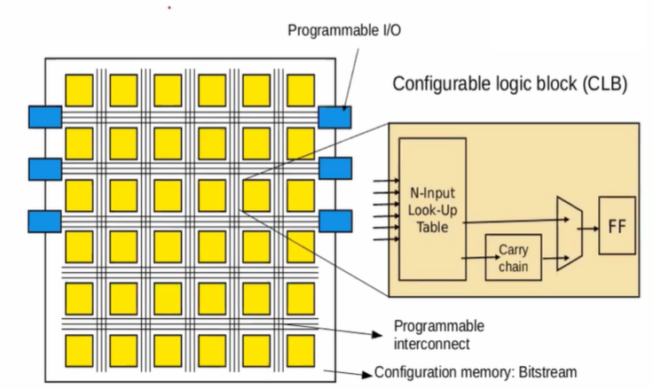

# FPGA_Workshop_VSD

FPGA - Fabric, Design and Architecture is a 5-day workshop organised by VLSI System Design (VSD).
Format: Cloud based Virtual Training Workshop

Duration: 14-18 December 2022

Instructor: Dr. Nanditha Rao

# Agenda of the workshop:
Day1:

- [Introduction to FPGA](#introduction-to-fpga)
  - [FPGA vs ASIC Comparison](#fpga-vs-asic-comparison)
  - [FPGA Architecture](#fpga-architecture)
  - [Introduction to Basys 3 FPGA Board](#introduction-to-basys-3-fpga-board)
- [1.2. Counter example using Vivado]
-[1.3. Counter Verilog explanation and implementation using Vivado]
-[1.4. Vivado timing, power, and area measurement for counter]
-[1.5. Introduction to VIO]

Day2:
1. Introduction to OpenFPGA and VTR (verilog-to-routing)
2. Introduction to VPR (versatile-place-and-route) using basic Earch fabric
3. Counter example using VPR/VTR openfpga flow

Day3:
1. Introduction to basic RISC-V core – rvmyth
2. Rvmyth – Vivado RTL to synthesis flow
3. Rvmyth – Vivado Synthesis to bitstream

Day4:
1. Introduction to opensource SOFA FPGA fabric
2. Steps to run counter example on SOFA
3. Characterize counter example in terms of area and timing
4. Post-implementation netlist and simulation using SOFA

Day5:
1. Steps to run RISC-V Core - on SOFA
2. Characterize RVmyth in terms of performance and area
3. Steps to generate rvmyth post-implementation netlist
4. Confirm RVmyth on SOFA behavioral simulation using Vivado

# Introduction to FPGA
FPGA:

  - Field Programmable Gate Arrays (FPGAs) are semiconductor devices that are based around a matrix of configurable logic blocks (CLBs) connected via programmable interconnects. FPGAs can be reprogrammed to desired application or functionality requirements after manufacturing. 
  - Generate customisable hardware.
  - Study the effect of area, speed and power of the digital circuits.
  - Logic disgn in FGPA includes: LUTs, Flipflops, configurable CLBs.
  
  ## FPGA vs ASIC Comparison
  
  - An ASIC is designed for a specific application while an FPGA is a multipurpose microchip you can reprogram for multiple applications.
  - The difference between ASIC and FPGA are as follows:
  
  | ASIC                                          | FPGA                          |
  | ---                                           | ---                           |
  | Application Specific Integrated Circuit       | Field Programmable Gate Array |
  | RTL to Layout                                 | RTL to bitstream              |
  | Sent to semiconductor foundry for fabrication | Programmed on FPGA boards     |
  | Cannot be reprogrammed                        | Can be reprogrammed           |
  
  ## FPGA Architecture
    
    The basic architecture of FPGA is given as below:
  
  
  
  ## Introduction to Basys 3 FPGA Board
  
  The Basys 3 board is a complete, ready-to-use digital circuit development platform based on the latest Artix®-7 Field Programmable Gate Array (FPGA) from Xilinx.
  
  The below figure shows the Basys 3 FPGA board with callouts.
  
  
  
  Basys 3 Callouts and component descriptions are as follows:
  
  | Callout | Component Description          | Callout | Component Description           |
  | ---     | ---                            | ---     | ---                             |
  |    1    | Power good LED                 |    9    | FPGA configuration reset button |
  |    2    |  Pmod port(s)                  |    10   | Programming mode jumper         |
  |    3    | Analog signal Pmod port (XADC) |    11   | USB host connector              |
  |    4    | Four digit 7-segment display   |    12   | VGA connector                   |
  |    5    | Slide switches (16)            |    13   | Shared UART/ JTAG USB port      |
  |    6    | LEDs (16)                      |    14   | External power connector        |
  |    7    | Pushbuttons (5)                |    15   | Power Switch                    |
  |    8    | FPGA programming done LED      |    16   | Power Select Jumper             |

