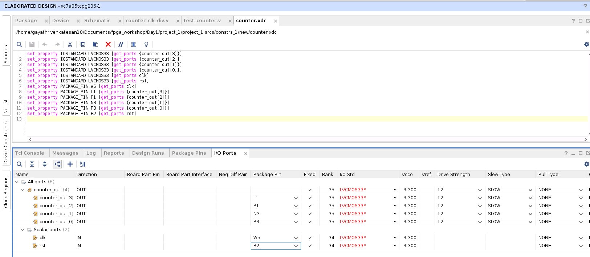
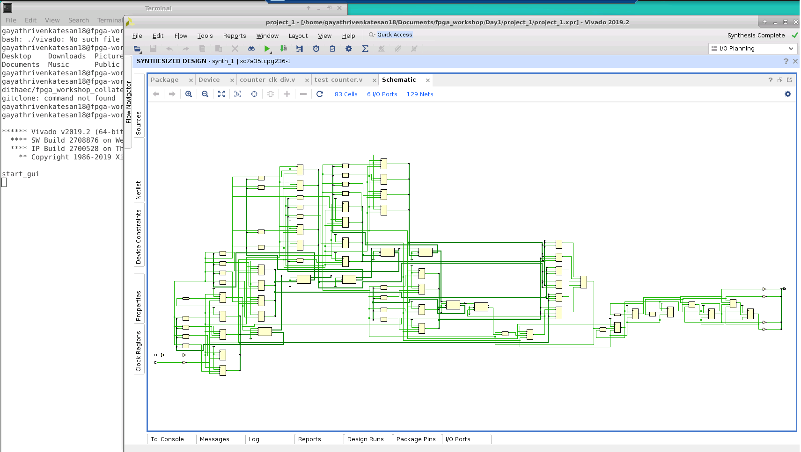

# FPGA_Workshop_VSD

FPGA - Fabric, Design and Architecture is a 5-day workshop organised by VLSI System Design (VSD).
Format: Cloud based Virtual Training Workshop

Duration: 14-18 December 2022

Instructor: Dr. Nanditha Rao

# Agenda of the workshop:
Day1:

- [Introduction to FPGA](#introduction-to-fpga)
  - [FPGA vs ASIC Comparison](#fpga-vs-asic-comparison)
  - [FPGA Architecture](#fpga-architecture)
  - [Introduction to Basys 3 FPGA Board](#introduction-to-basys-3-fpga-board)
- [Counter example using Vivado](counter-example-using-vivado)
  - [Behavioural Simulation of 4-bit counter](#behavioural-simulation-of-4-bit-counter)
    - [RTL Description for 4-bit counter](#rtl-description-for-4-bit-counter)
    - [Output Waveform](#output-waveform)
   - [Elaborated Design](#elaborated-design)
     - [IO Constraints](#io-constraints)
   - [Synthesis](#synthesis)
   - [Implementation](#implementation)
   - [Clock Constraints](#clock-constraints)
   - [Reports](#reports)
     - [Timing report](#timing-report)
     - [Power report](#power-report)
     - [Utilization Report](#utilization-report)
   - [Bitsream Generation](#bitstream-generation)
   - [Virtual Input-Output](#virtual-input-output)
- [1.3. Counter Verilog explanation and implementation using Vivado]
- [1.4. Vivado timing, power, and area measurement for counter]
- [1.5. Introduction to VIO]

Day2:
1. Introduction to OpenFPGA and VTR (verilog-to-routing)
2. Introduction to VPR (versatile-place-and-route) using basic Earch fabric
3. Counter example using VPR/VTR openfpga flow

Day3:
1. Introduction to basic RISC-V core – rvmyth
2. Rvmyth – Vivado RTL to synthesis flow
3. Rvmyth – Vivado Synthesis to bitstream

Day4:
1. Introduction to opensource SOFA FPGA fabric
2. Steps to run counter example on SOFA
3. Characterize counter example in terms of area and timing
4. Post-implementation netlist and simulation using SOFA

Day5:
1. Steps to run RISC-V Core - on SOFA
2. Characterize RVmyth in terms of performance and area
3. Steps to generate rvmyth post-implementation netlist
4. Confirm RVmyth on SOFA behavioral simulation using Vivado

# Introduction to FPGA
FPGA:

  - Field Programmable Gate Arrays (FPGAs) are semiconductor devices that are based around a matrix of configurable logic blocks (CLBs) connected via programmable interconnects. FPGAs can be reprogrammed to desired application or functionality requirements after manufacturing. 
  - Generate customisable hardware.
  - Study the effect of area, speed and power of the digital circuits.
  - Logic disgn in FGPA includes: LUTs, Flipflops, configurable CLBs.
  
  ## FPGA vs ASIC Comparison
  
  - An ASIC is designed for a specific application while an FPGA is a multipurpose microchip you can reprogram for multiple applications.
  - The difference between ASIC and FPGA are as follows:
  
  | ASIC                                          | FPGA                          |
  | ---                                           | ---                           |
  | Application Specific Integrated Circuit       | Field Programmable Gate Array |
  | RTL to Layout                                 | RTL to bitstream              |
  | Sent to semiconductor foundry for fabrication | Programmed on FPGA boards     |
  | Cannot be reprogrammed                        | Can be reprogrammed           |
  
  ## FPGA Architecture
  
  The basic architecture of FPGA is given as below.
  
  
  
  ## Introduction to Basys 3 FPGA Board
  
  The Basys 3 board is a complete, ready-to-use digital circuit development platform based on the latest Artix®-7 Field Programmable Gate Array (FPGA) from Xilinx.
  
  The below figure shows the Basys 3 FPGA board with callouts.
  
  
  
  Basys 3 Callouts and component descriptions are as follows:
  
  | Callout | Component Description          | Callout | Component Description           |
  | ---     | ---                            | ---     | ---                             |
  |    1    | Power good LED                 |    9    | FPGA configuration reset button |
  |    2    |  Pmod port(s)                  |    10   | Programming mode jumper         |
  |    3    | Analog signal Pmod port (XADC) |    11   | USB host connector              |
  |    4    | Four digit 7-segment display   |    12   | VGA connector                   |
  |    5    | Slide switches (16)            |    13   | Shared UART/ JTAG USB port      |
  |    6    | LEDs (16)                      |    14   | External power connector        |
  |    7    | Pushbuttons (5)                |    15   | Power Switch                    |
  |    8    | FPGA programming done LED      |    16   | Power Select Jumper             |

# Counter example using Vivado

- Counters are sequential logic circuits that proceed through a well defined sequence of states after application of clock pulses.
- Counters are used for a counting pulses.
- Counters are constructed using Flipflops and logic gates.

## Behavioural Simulation of 4-bit counter
### RTL Description for 4-bit counter
- The RTL Code for 4-bit counter is given as follows and is to be implemented in Xilinx Vivado tool.

Verilog code:
```
`timescale 1ns / 1ps
//////////////////////////////////////////////////////////////////////////////////

// Description: 4 bit counter with source clock (100MHz) division.

/*

////////////4 bit counter block///////////////////
always @(posedge clk)
begin

if(rst)
begin
counter_out<=4'b0000;
//div_clk <= 1'b0;
end
else
begin
counter_out<= counter_out+1;
end
end

endmodule 

*/

//////////////////////////////////////////////////////////////////////////////////
module counter_clk_div(clk,rst,counter_out);
input clk,rst;
reg div_clk;
reg [25:0] delay_count;
output reg [3:0] counter_out;

//////////clock division block////////////////////


always @(posedge clk)
begin

if(rst)
begin
delay_count<=26'd0;
//counter_out<=4'b0000;
div_clk <= 1'b0; //initialise div_clk


//uncomment this line while running just the div clock counter for simulation purpose
//counter_out<=4'b0000;
end
else

//uncomment this line while running just the div clock counter for simulation purpose
if(delay_count==26'd212)

//comment this line while running just the div clock counter for simulation purpose
//if(delay_count==26'd32112212)
begin
delay_count<=26'd0; //reset upon reaching the max value
div_clk <= ~div_clk;  //generating a slow clock
end
else
begin
delay_count<=delay_count+1;
end
end


/////////////4 bit counter block///////////////////
always @(posedge div_clk)
begin

if(rst)
begin
counter_out<=4'b0000;
end
else
begin
counter_out<= counter_out+1;
end
end

endmodule 
```

Run the verilog code along with the following testbench file for the verification of counter behaviour.

Testbench code:
```
`timescale 1ns / 1ps

module test_counter();
reg clk, reset;
wire [3:0] out;

//create an instance of the design
counter_clk_div dut(clk, reset, out);  

initial begin
clk=0;  //at time=0
reset=1;//at time=0
#20; //delay 20 units
reset=0; //after 20 units of time, reset becomes 0
end

always 
#5 clk=~clk;  // toggle or negate the clk input every 5 units of time

endmodule 
```

### Output Waveform
The output waveform for 4-bit counter is as follows:


## Elaborated Design
- In the RTL Analysis section of the Flow Navigator, select Open Elaborated Design to load the elaborated netlist, the active constraint set, and the target device into memory.
- The schematic for the 4-bit counter will be obtained after simulation which is shown as below.
  
  

### IO Constraints
  - The IO Constraints has to be given by providing the Package Pin and Standard Pin details in I/O planning view.
  - I/O Planning view can be changed from default layout on top right corner of Vivado tool.

The constraints for input and output ports are given as follows in the tool.



The constraints can also be viewd as .xdc file under constraints tab in sources.

## Synthesis
- After the port mappling, click on Run synthesis to perform synthesis operation.
- When you open a synthesized design, the Vivado Design Suite opens the synthesized netlist and applies physical and timing constraints against a target part.
- The different elements of the synthesized design are loaded into memory, and you can analyze and modify these elements as needed to complete the design.
The synthesized design is as follows:


The schematic of the synthesized design is as follows:



## Implementation
- The implementation of the design can be done after the process of synthesisby clicking on Run implementation in Flow Hierachy.
- When you open an implemented design in the Flow Navigator, the Vivado IDE opens the implemented netlist and applies the physical and timing constraints used during implementation, placement, and routing results against the implemented part. 
- The placed logic and routed connections of the implemented design are loaded into memory, and you can analyze and modify the elements as needed to complete the design.

The implemented design is shown below.


The schematic of the implemented design is shown as below.


## Clock Constraints
- The clock period can be changed to check the timing of the design.
- The clock period is set to 100MHz in Constraints wizard of Synthesis which is mentioned as below.


## Reports
- The report of the design will give the detailed version of the design
- The various reports in Vivado are
  - Timing report
  - Power report
  - Utilization report
 
 ### Timing report
 - The Vivado IDE provides a graphical way to configure and view timing analysis results.
 - The below timing report is shown for the clock period of 100MHz.
 
   
 
 - The detalied timing summary can be obtained by clicking on the Slack values.
 
   
 
 ### Power report
 - The power report experiments with power parameters and quickly estimate power at any stage of the design
 - The below power report is shown for the clock period of 100MHz.
 
   
 
 ### Utilization Report
 - The utilization report analyzes the utilization statistics of various types of device resources.
 - The below utilization report is shown for the clock period of 100MHz.
 
   
   
## Bitstream Generation
- The next step is to generate the bitstream of the design. The .bit file will be generated by clickin on Generate bitstream in Flow Hierachy.
- This bitstream file will be dumped into the Basys 3 board to check the results.

## Virtual Input-Output
- In the absence of physical access to the target hardware, we can use this debug feature to drive and monitor signals that are present on the real hardware.
- In the IP Catalog, search for VIO to modify the VIO settings.
- IP Catalog snippet for VIO is shown below.

   
   
- The corresponding change has to be done in the verilog code also as shown below.
  
  
   
- By ding so, we can check the inputs and outputs virtually by connecting to the target hardware
 
